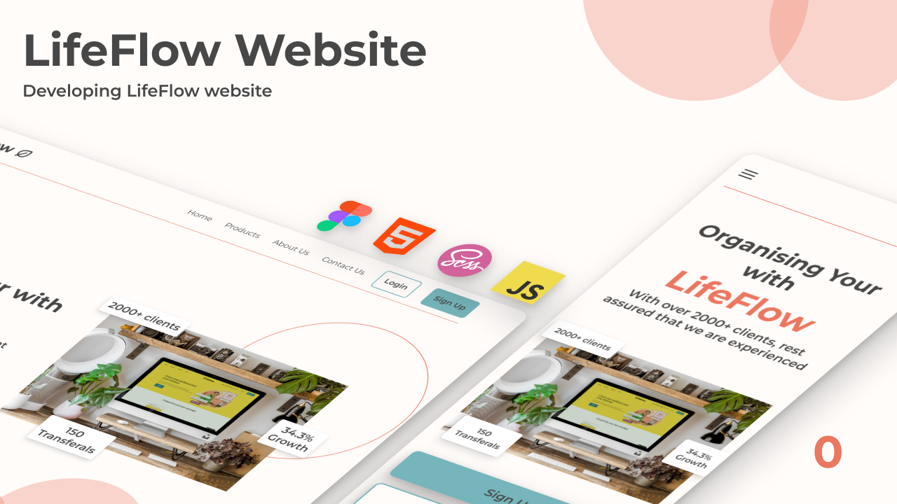

# LifeFlow Website

## Project overview

This project is meant to showcase the process from design to deployment of a static website. The first thing covered is

### Design

This is a quick overview of the design process, how LifeFlow's (a made-up company) website is designed, the typography decisions, colours & other elements of the design.

### Responsive navigation

We go over how to make the top bar of the website:

1. We'll see how to import the logo of the website.
2. How to make the navigation.
3. How to make the top bar responsive
4. How to make the mobile navigation
5. The javascript required to make the mobile navigation open & closeable.

## Design

**NB: This section is not necessary if you are just into the development protion**

The [designs](./design/) were made using [Figma Design](https://www.figma.com/file/OPFJjIl5HeKMCrzPVcTd6g/Untitled?type=design&node-id=0%3A1&t=dCN9IlLBl0GD6qK3-1).

### Design Approach

I didn't take the traditional approach when designing the website. Usually, I would

1. make a wireframes
2. make a design system/[style guide](./style-guide.md)
3. identify common components & design components
4. Design the UI

But this time, I just jumped into the design. This project was just to focus on the development cycle. I just jumped into Figma and started designing. As time went by, I started making the style guide on the fly.

### Figma Tips

#### Auto Layout

If you look at the pages that were designed, you will notice that it's not 1 frame, but instead an auto layout. This just makes it easier if you want to rearrange different sections of a design. It works well with a large design.

#### Components

If you go to the Thumbnails page on the Figma design project, you'll notice that there's a thumbnail component. Using components makes it easier to keep different thumbnails consistent with 1 design, but flexible enough to allow you to make changes.
